cm007 Exercises: Exploring Aesthetic Mappings
================

Beyond the x and y aesthetics
=============================

Switch focus to exploring aesthetic mappings, instead of geoms.

``` r
library(tidyverse)
```

    ## ── Attaching packages ──────────────────────────────────────────────────────────────────────────────────────────── tidyverse 1.2.1 ──

    ## ✔ ggplot2 2.2.1     ✔ purrr   0.2.4
    ## ✔ tibble  1.4.1     ✔ dplyr   0.7.4
    ## ✔ tidyr   0.7.2     ✔ stringr 1.2.0
    ## ✔ readr   1.1.1     ✔ forcats 0.2.0

    ## ── Conflicts ─────────────────────────────────────────────────────────────────────────────────────────────── tidyverse_conflicts() ──
    ## ✖ dplyr::filter() masks stats::filter()
    ## ✖ dplyr::lag()    masks stats::lag()

``` r
library(gapminder)
```

Shapes
------

-   Try a scatterplot of `gdpPercap` vs `pop` with a categorical variable (continent) as `shape`.

List of shapes can be found [at the bottom of the `scale_shape` documentation](https://ggplot2.tidyverse.org/reference/scale_shape.html).

``` r
gvsl = ggplot(gapminder, aes(gdpPercap, lifeExp)) +
  scale_x_log10()
gvsl + geom_point(aes(shape = continent), alpha = 0.6)
```

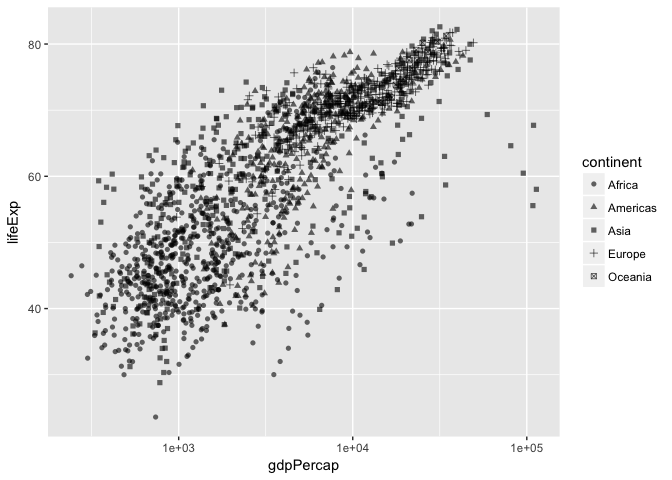

``` r
#aes links a variable to something we can see on the plot. 
```

-   As with all (?) aesthetics, we can also have them *not* as aesthetics!
    -   Try some shapes: first as integer from 0-24, then as keyboard characters.
    -   What's up with `pch`?

``` r
gvsl +geom_point(shape = 7) #when not putting something in aes, you can have it as an outright value, but if within aes, then it links a variable to something.
```

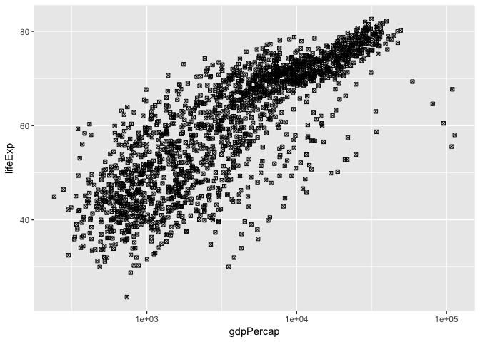

``` r
gvsl + geom_point(pch = 7) #pch is a base R way to do assign shapes?
```


``` r
gvsl + geom_point(shape = "$") #makes all your points as $
```

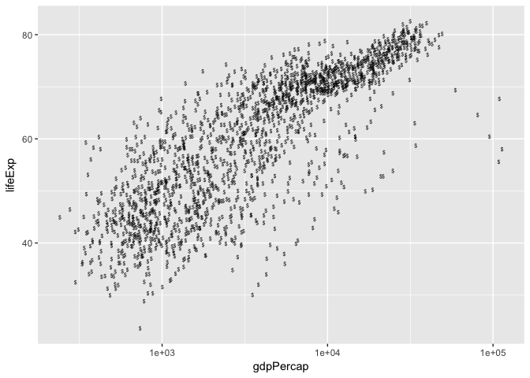

Colour
------

``` r
gvsl +geom_point(aes(colour = continent))
```

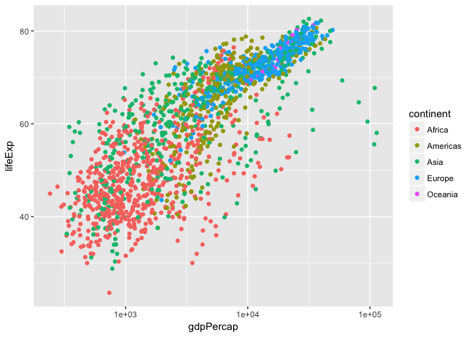

Make a scatterplot. Then:

-   Try colour as categorical variable.
-   Try `colour` and `color`.
-   Try colour as numeric variable.
    -   Try `trans="log10"` for log scale.

``` r
gvsl + geom_point(aes(colour = pop)) #this is a linear scale
```

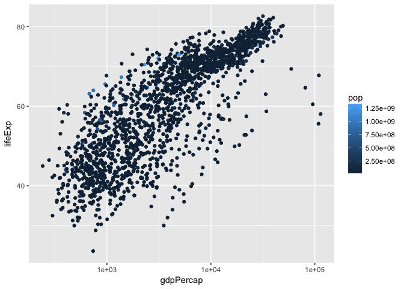

``` r
gvsl + geom_point(aes(colour = pop)) + scale_colour_continuous(trans = "log10") #log scale.
```

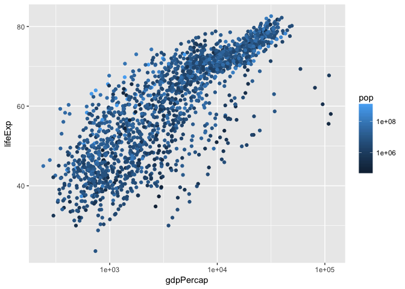

``` r
gvsl + geom_point(aes(colour = lifeExp > 60)) #makes columns of True/False. maps this to colour. 
```

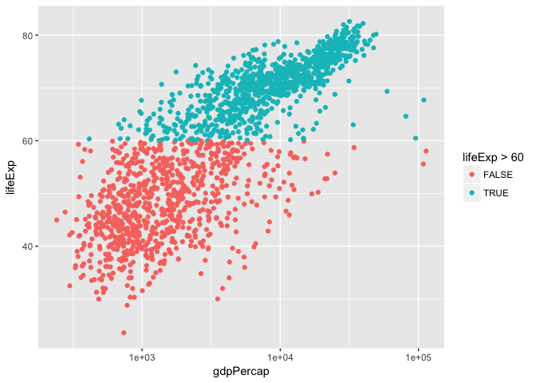

Make a line plot of `gdpPercap` over time for all countries. Colour by `lifeExp > 60` (remember that `lifeExp` looks bimodal?)

Try adding colour to a histogram. How is this different?

``` r
ggplot(gapminder, aes(lifeExp)) + geom_histogram(aes(colour = continent)) #doesnt color in the perimeter. instead use fill:
```

    ## `stat_bin()` using `bins = 30`. Pick better value with `binwidth`.

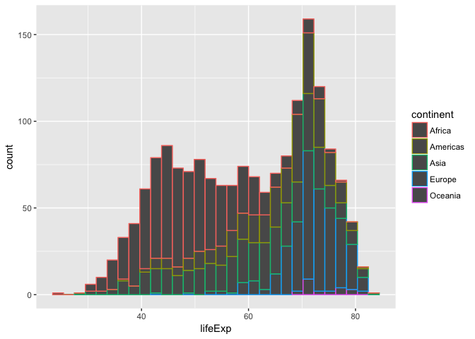

``` r
ggplot(gapminder, aes(lifeExp)) + geom_histogram(aes(fill = continent)) #overplotting, too much info on one plot. we don't know if the red rectangle at top is just that, or if it starts from bottom.
```

    ## `stat_bin()` using `bins = 30`. Pick better value with `binwidth`.

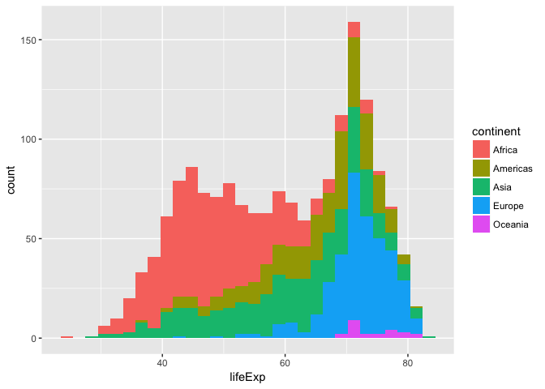

Facetting
---------

Make histograms of `gdpPercap` for each continent. Try the `scales` and `ncol` arguments.

``` r
ggplot(gapminder, aes(lifeExp)) + 
  facet_wrap(~continent, scales = "free_x") +
  geom_histogram()
```

    ## `stat_bin()` using `bins = 30`. Pick better value with `binwidth`.

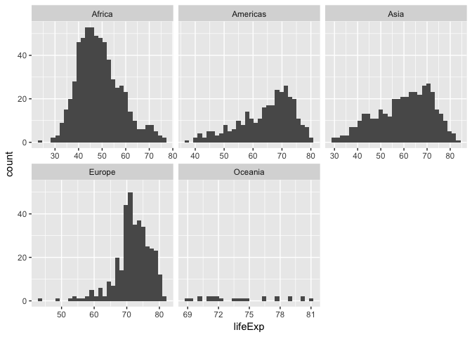

``` r
#free_x keeps a common scale, easier to compare scales.
```

Remove Oceania. Add another variable: `lifeExp > 60`.

``` r
ggplot(gapminder, aes(gdpPercap)) + 
  facet_grid(continent ~ lifeExp >60, scales = "free_x") + 
  geom_histogram() +
  scale_x_log10()
```

    ## `stat_bin()` using `bins = 30`. Pick better value with `binwidth`.

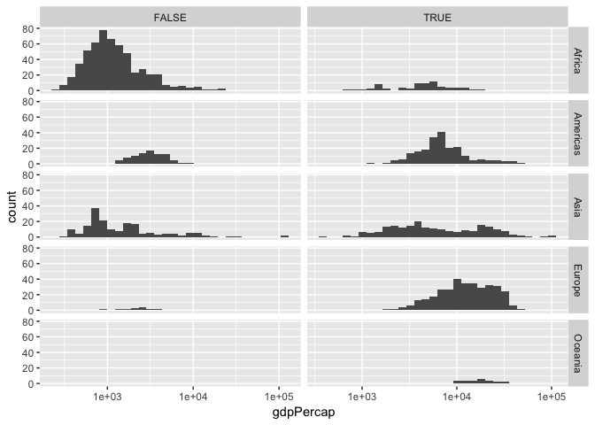

Bubble Plots
------------

-   Add a `size` aesthetic to a scatterplot. What about `cex`?
-   Try adding `scale_radius()` and `scale_size_area()`. What's better?
-   Use `shape=21` to distinguish between `fill` (interior) and `colour` (exterior).

``` r
#used to map a 3rd variable onto scatterplot by changing size of points. 
gvsl + geom_point(aes(size = pop), alpha = 0.33) #here the size of bubbles is not super meaningful. use scale_size_area to make size of bubble proportional.
```

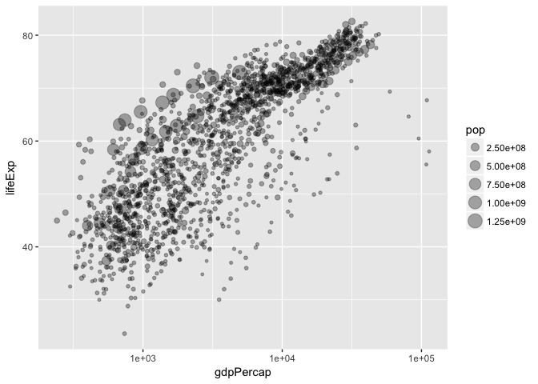

``` r
gvsl + geom_point(aes(size = pop), alpha =0.2)+
  scale_size_area()
```

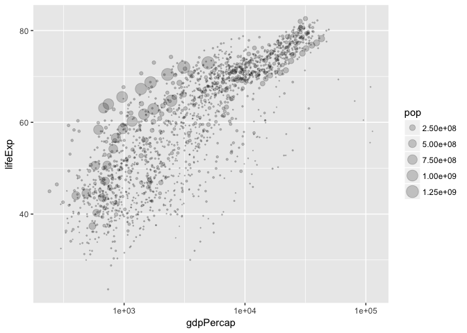

``` r
gvsl + geom_point(aes(size = pop, fill = continent), shape = 21, colour = "black", alpha = 0.5)
```

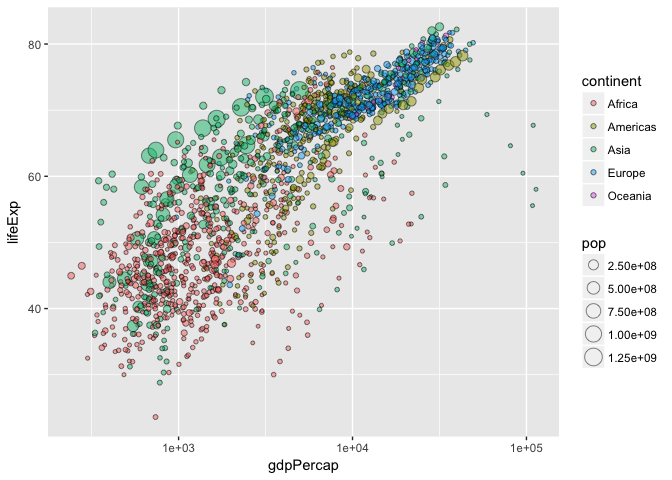

``` r
#here we are making exterior of the circle black, but inside is the continent.
#
```

"Complete" plot
---------------

Let's try plotting much of the data.

-   gdpPercap vs lifeExp with pop bubbles
-   facet by year
-   colour by continent

``` r
gvsl + geom_point(aes(size = pop, colour = continent)) +
  scale_size_area()+
  facet_wrap(~year)
```

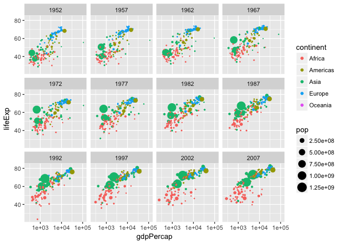

Continue from last time (geom exploration with `x` and `y` aesthetics)
======================================================================

Path plots
----------

Let's see how Rwanda's life expectancy and GDP per capita have evolved over time, using a path plot.

-   Try `geom_line()`. Try `geom_point()`.
-   Add `arrow=arrow()` option.
-   Add `geom_text`, with year label.

Two categorical variables
-------------------------

Try `cyl` (number of cylinders) ~ `am` (transmission) in the `mtcars` data frame.

-   Scatterplot? Jitterplot? No.
-   `geom_count()`.
-   `geom_bin2d()`. Compare with `geom_tile()` with `fill` aes.

Overplotting
------------

Try a scatterplot with:

-   Alpha transparency.
-   `geom_hex()`
-   `geom_density2d()`
-   `geom_smooth()`

Bar plots
---------

How many countries are in each continent? Use the year 2007.

1.  After filtering the gapminder data to 2007, make a bar chart of the number of countries in each continent. Store everything except the geom in the variable `d`.

2.  Notice the y-axis. Oddly, `ggplot2` doesn't make it obvious how to change to proportion. Try adding a `y` aesthetic: `y=..count../sum(..count..)`.

**Uses of bar plots**: Get a sense of relative quantities of categories, or see the probability mass function of a categorical random variable.

Polar coordinates
-----------------

-   Add `coord_polar()` to a scatterplot.

Want more practice?
===================

If you'd like some practice, give these exercises a try

**Exercise 1**: Make a plot of `year` (x) vs `lifeExp` (y), with points coloured by continent. Then, to that same plot, fit a straight regression line to each continent, without the error bars. If you can, try piping the data frame into the `ggplot` function.

**Exercise 2**: Repeat Exercise 1, but switch the *regression line* and *geom\_point* layers. How is this plot different from that of Exercise 1?

**Exercise 3**: Omit the `geom_point` layer from either of the above two plots (it doesn't matter which). Does the line still show up, even though the data aren't shown? Why or why not?

**Exercise 4**: Make a plot of `year` (x) vs `lifeExp` (y), facetted by continent. Then, fit a smoother through the data for each continent, without the error bars. Choose a span that you feel is appropriate.

**Exercise 5**: Plot the population over time (year) using lines, so that each country has its own line. Colour by `gdpPercap`. Add alpha transparency to your liking.

**Exercise 6**: Add points to the plot in Exercise 5.
